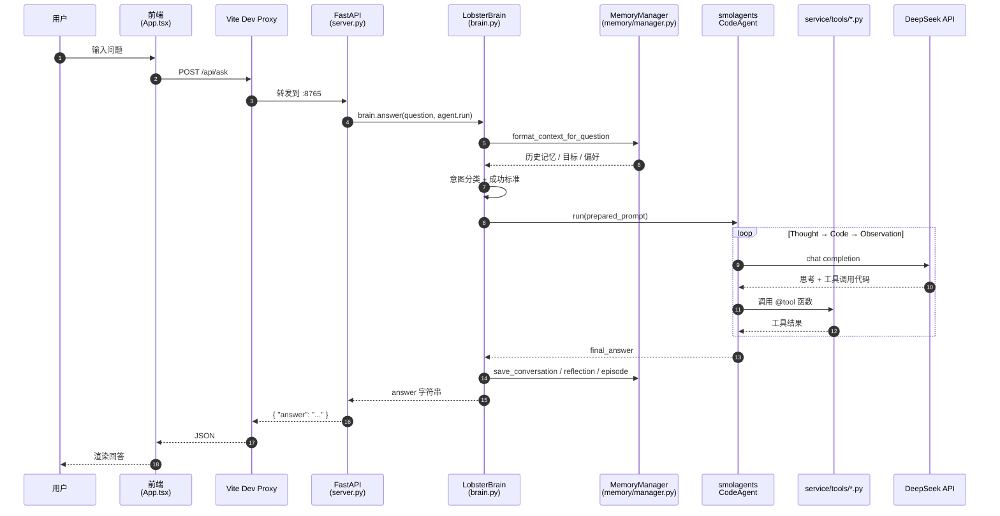
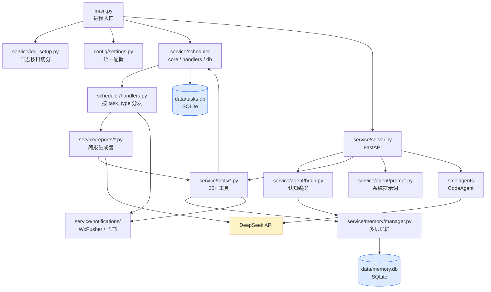
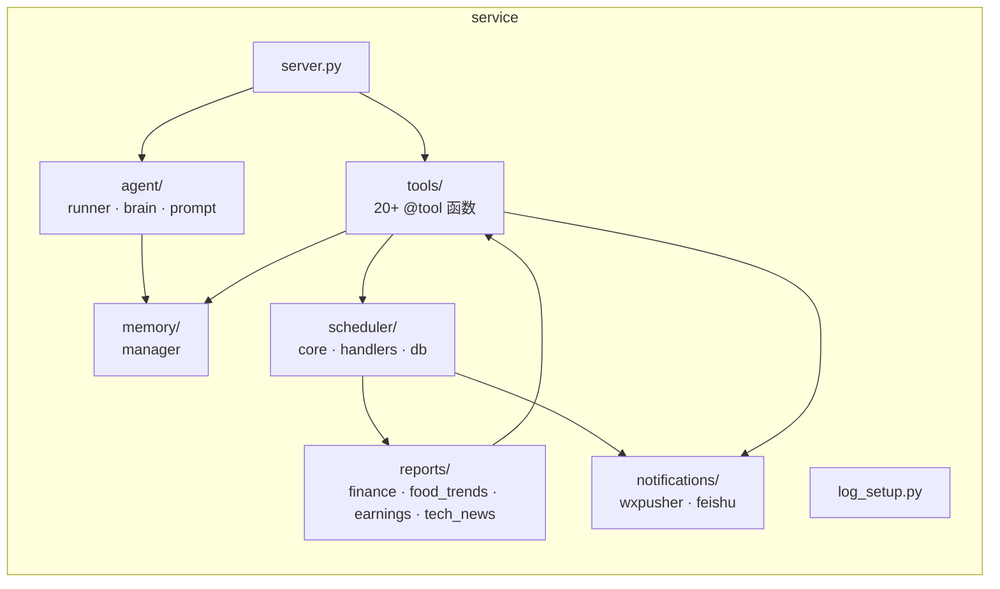
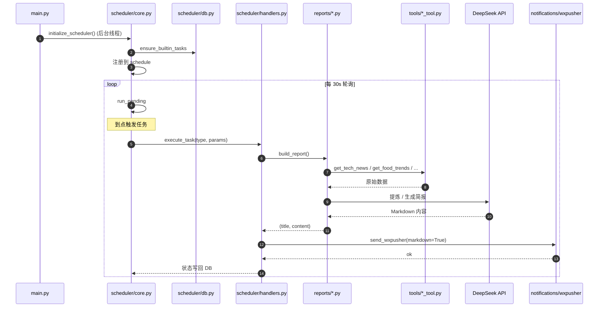

# Lobster 架构图

本文档用 Mermaid 描述一次问答的完整链路与系统模块依赖。GitHub / VSCode 直接渲染。

## 1. 一次问答链路（前端到 LLM）



## 2. 模块依赖（后端核心）



## 3. 子包结构（service/）



## 4. 后台任务调度（与问答并行）



## 5. 数据流总结

| 数据 | 来源 | 落地 | 读取者 |
|---|---|---|---|
| 用户问题 | 前端 InputBar | 内存（短期 SQL conv 表） | brain.answer |
| Agent 回答 | DeepSeek API | conversation / episode / reflection | 下次 prepare 时拼上下文 |
| 任务定义 | 内置常量 + create_task 工具 | data/tasks.db | scheduler/core 启动时加载 |
| 简报内容 | RSS 多源 + LLM 提炼 | 不持久化 | 直接推送到 WxPusher |
| 应用日志 | 全局 logger | logs/lobster.log（按日切分）| analyze_logs 工具 |

## 6. 关键依赖

| 依赖 | 用途 | 文件 |
|---|---|---|
| smolagents | CodeAgent 引擎 | service/agent/runner.py · server.py |
| LiteLLM | 模型层适配（DeepSeek/OpenAI 兼容）| server.py · reports/tech_news.py |
| openai | reports/food_trends 直接调用 DeepSeek | reports/food_trends.py |
| FastAPI + uvicorn | HTTP 服务 | server.py |
| schedule | 任务调度 | scheduler/core.py |
| psutil | 系统监控 | tools/system_monitor_tool.py |
| requests | RSS / Webhook | tools/*_tool.py · notifications/* |
| sqlite3 | 持久化（标准库） | memory/manager.py · scheduler/db.py |

## 7. 配置与横切关注点

```
config/settings.py        ← 全局单例
        │
        ├── server          BACKEND_PORT / HOST
        ├── agent           MODEL_ID / TIMEOUT / API_KEY
        ├── memory          DB_PATH / RETENTION_DAYS
        ├── task            DB_PATH
        ├── monitor         CPU/MEM/DISK 阈值
        ├── alert           HISTORY_FILE / DEDUPE_MINUTES
        ├── notification    WXPUSHER / FEISHU 配置
        ├── tool            TAVILY_API_KEY / HTTP_TIMEOUT
        └── log             LOG_FILE / LEVEL / BACKUP_DAYS
```

所有模块通过 `from config import settings` 读取，环境变量可覆盖（.env）。

四、落地路径建议（先做什么）

第一阶段（4 周）—— 把现在能用的搬上生产
1. 数据库改 Postgres
2. 部署 Docker 化
3. 告警分级 + Redis 去重
4. 加权限模型雏形
5. 接 1 个真实数据源（最痛的那个，比如 Prometheus）

第二阶段（4 周）—— 接入支付核心数据
6. 接日志（ELK）+ 链路（SkyWalking）+ 业务指标
7. 加 runbook 系统
8. 加变更感知

第三阶段（持续）—— 流程规范化
9. PR 审查 agent
10. 发布前检查
11. 故障复盘助手
12. 知识库 + 向量检索

第四阶段—— 高阶能力
13. 自动化处置（先观察，再灰度，再放权）
14. 成本/质量优化

  ---
五、几个特别要注意的坑

1. 不要让 LLM 触碰生产决策
   LLM 适合总结、归纳、检索、撰写。涉及钱、流量、用户的关键操作，必须走规则引擎或人工确认。比如告警是否升级、是否熔断、是否回滚——这些用 if/else 写死，LLM
   只负责把决策依据讲清楚。

2. 工具粒度要细
   现在很多 tool 一个函数干很多事，agent 难精确控制。改成单一职责小工具 + 编排在 prompt/runbook 层。

3. Prompt 是核心资产，不是代码注释
   当前 agent_prompt.py 太简单。支付域要写详尽的 system prompt：边界、禁止事项、引用 runbook、输出格式约束、合规提示。这部分迭代成本远超你预期。

4. 不要替代值班，要赋能值班
   真实场景里，让 LLM 自动处置故障是高风险且 ROI 低的方向。真正能落地的是「让值班同学少看 5 个监控面板」「故障复盘从 4 小时降到 1
   小时」。瞄准这种确定性收益。

5. 自身可用性 SLA 要远高于它服务的系统
   监控告警系统挂了比业务挂了更糟（因为其他人不知道业务挂了）。Lobster 自身要做 HA、要有降级（LLM 不可用时退化成纯规则告警）。

  ---
要不要我先挑其中一两项（比如 Prometheus 接入 + 告警分级，或 PR 审查
agent）做个可执行的落地方案？这样能更具体看出从「财经简报」到「支付稳定性」的代码改造量。