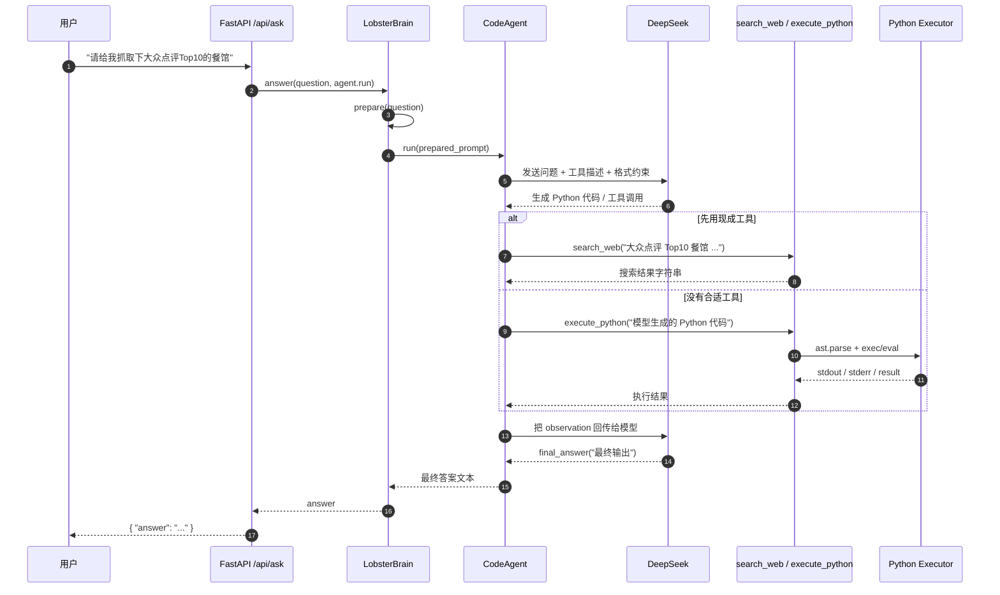

# 请求示例：`请给我抓取下大众点评Top10的餐馆` 的完整调用链路

本文档说明 Lobster 处理这类请求时，后端内部会经历哪些阶段：**问题进入 → 意图解析 → 模型生成 Python/工具调用 → 执行 → 汇总结果 → 返回最终答案**。

## 1. 先说结论

这类请求在当前项目里通常不是“后端固定写死一个大众点评抓取器”，而是：

1. `FastAPI` 收到用户问题。
2. `LobsterBrain` 组装上下文和提示词。
3. `smolagents.CodeAgent` 把问题交给大模型（当前通常是 DeepSeek）。
4. **大模型决定怎么做**：
   - 如果已有工具足够，就先调用工具，比如 `search_web(...)`。
   - 如果没有现成工具能直接完成，就调用 `execute_python(...)`，把**模型自己生成的 Python 代码字符串**交给后端执行。
5. 工具结果返回给 `CodeAgent`。
6. `CodeAgent` 再让模型根据结果产出最终答案。
7. HTTP 接口返回 `{ "answer": "..." }`。

所以它更接近：

**用户问题 → 大模型生成行动代码 → 后端执行 → 结果回流给大模型 → 输出答案**

而不是：

**用户问题 → 后端模板化转换成固定 Python → 直接执行**

---

## 2. 入口链路

对应代码：

- `service/server.py`
- `service/agent/brain.py`
- `service/agent/prompt.py`
- `service/tools/code_executor_tool.py`

### 2.1 用户请求进入 HTTP 接口

前端或客户端向：

```http
POST /api/ask
{
  "question": "请给我抓取下大众点评Top10的餐馆"
}
```

`service/server.py` 的 `ask()` 会执行：

```python
answer_str = get_brain().answer(
    question,
    get_agent().run,
    fast_runner=get_agent_fast().run,
    session_id="http",
)
```

也就是说：

- `question` 先交给 `LobsterBrain`
- 真正执行 agent loop 的是 `CodeAgent.run(...)`

### 2.2 Brain 做问题解析和上下文拼装

`LobsterBrain.answer()` 会先调用：

```python
prepared = self.prepare(question)
```

这里会做几件事：

1. 规范化用户问题
2. 识别意图（如 `qa`、`analysis`、`building` 等）
3. 生成成功标准
4. 从记忆系统补充上下文
5. 产出最终要发给 `CodeAgent` 的 prompt

对这条问题，典型理解会是：

- 用户目标：拿到“大众点评 Top10 餐馆”列表
- 需要的数据：餐馆名称、排序依据、链接、可能还有城市/商圈
- 任务性质：更像“联网信息抓取/整理”

---

## 3. 为什么会走到 Python 执行

`service/agent/prompt.py` 明确告诉模型：

```text
- 优先使用已有工具
- 如果没有合适工具，用 execute_python 直接写代码执行
```

当前项目里**没有“大众点评 Top10 餐馆”专用工具**。已注册的相关通用能力主要是：

- `search_web(query, max_results)`
- `execute_python(code)`

因此，这个请求大概率会走下面两种路径之一：

| 路径 | 说明 |
|---|---|
| 工具优先路径 | 先 `search_web("大众点评 Top10 餐馆 ...")`，拿搜索结果后整理 |
| Python 路径 | 模型直接调用 `execute_python(...)`，在代码里用 `requests`/解析 HTML 的方式抓页面或整理结果 |

如果模型判断 `search_web` 不够精确，或者想自己拼请求、解析页面，它就会生成 Python 代码并调用 `execute_python(...)`。

---

## 4. CodeAgent 和大模型如何协作

`service/server.py` 里 `_build_agent()` 创建的是：

```python
CodeAgent(
    tools=[..., execute_python, search_web, ...],
    model=LiteLLMModel(...),
    prompt_templates=get_prompt_templates(),
)
```

这里的职责分工是：

| 组件 | 职责 |
|---|---|
| DeepSeek（或当前配置模型） | 生成 Python 代码、决定调用哪个工具、整理最终回答 |
| CodeAgent | 把 prompt 和工具描述发给模型，解析模型输出，执行代码/工具调用，循环多轮 |
| `execute_python` | 执行模型传入的 Python 字符串 |

所以这类请求里，**Python 代码本身通常来自大模型**，不是 `CodeAgent` 手写的。

---

## 5. 一次可能的完整执行流程

下面是一个**符合当前架构的典型流程**。注意：这是说明链路的示例，不代表每次生成的代码完全一致。

### Step 1：模型先规划

模型收到 prompt 后，可能会形成类似思路：

1. 明确“Top10”是不是指某个城市、某个榜单、某个分类
2. 尝试先搜索公开页面
3. 如果搜索结果足够，就整理输出
4. 如果不够，就执行自定义 Python 进一步抓取或解析

### Step 2：模型生成第一轮代码

模型可能先输出一段工具调用代码，例如：

```python
results = search_web("大众点评 Top10 餐馆 榜单 上海 site:dianping.com")
print(results)
```

或者更激进地直接生成：

```python
data = execute_python("""
import requests

url = "https://www.dianping.com/..."
resp = requests.get(url, timeout=10)
print(resp.text[:2000])
""")
print(data)
```

此时要注意两点：

1. 代码是**大模型输出**的。
2. `CodeAgent` 只是负责接收并执行。

### Step 3：CodeAgent 执行工具

如果模型调用的是：

```python
search_web(...)
```

则执行到 `service/tools/web_search_tool.py`：

- 读取 `TAVILY_API_KEY`
- 调用 Tavily
- 返回 markdown 风格结果字符串

如果模型调用的是：

```python
execute_python("...")
```

则执行到 `service/tools/code_executor_tool.py`。

### Step 4：`execute_python` 执行模型生成的代码

`execute_python(code)` 内部逻辑是：

1. `ast.parse(code)` 解析代码
2. 把最后一个表达式单独拿出来，以便返回值
3. `exec(...)` 执行主体语句
4. 如最后一行是表达式则 `eval(...)`
5. 或读取 `_result`
6. 汇总 `stdout / stderr / result`

也就是说，模型生成的这段 Python 会在后端进程里真正执行。

---

## 6. 一个更完整的示例

假设模型先搜，再整理，可能形成这样的链路。

### 6.1 第一轮：搜索

模型输出代码：

```python
raw = search_web("大众点评 Top10 餐馆 上海 site:dianping.com")
print(raw)
```

执行后，Agent 得到 observation，类似：

```text
1. [上海餐厅热门榜 - 大众点评](...)
2. [上海美食必吃榜 - 大众点评](...)
...
```

### 6.2 第二轮：整理

模型基于 observation，再输出代码：

```python
lines = raw.splitlines()
top10 = [line for line in lines if line.strip().startswith(tuple(str(i) + "." for i in range(1, 11)))]
_result = "\n".join(top10[:10])
```

执行后得到：

```text
Result:
1. ...
2. ...
...
10. ...
```

### 6.3 第三轮：产出最终回答

模型最后必须按 `CodeAgent` 规定输出：

```python
final_answer(\"\"\"以下是为你整理的大众点评 Top10 餐馆结果：

1. 餐馆A
2. 餐馆B
...
10. 餐馆J
\"\"\")
```

然后 `CodeAgent` 返回字符串结果给 `LobsterBrain`。

---

## 7. 返回给前端的最后一步

`LobsterBrain.answer()` 拿到最终答案后，会：

1. 保存用户对话
2. 保存 agent 回答
3. 记录 reflection / episode
4. 把最终文本返回给 `server.py`

然后 `service/server.py` 返回：

```json
{
  "answer": "以下是为你整理的大众点评 Top10 餐馆结果：..."
}
```

---

## 8. 用 Mermaid 画成时序图



---

## 9. 这条请求在当前项目里的真实约束

虽然链路上**可以**这样工作，但“大众点评 Top10 餐馆”这类请求还受几个现实因素影响：

1. **项目没有专用 Dianping 工具**  
   所以结果更依赖模型临时决策和通用联网能力。

2. **`search_web` 依赖 Tavily**  
   如果没配 `TAVILY_API_KEY`，搜索工具不可用。

3. **页面抓取可能受目标站反爬限制**  
   即使模型生成了 `requests` 代码，也不保证目标站会返回可解析页面。

4. **“Top10”语义不够完整**  
   用户没指定城市、榜单类型、品类。模型可能需要追问，或者自己做默认假设。

因此，这个请求的理想链路是成立的，但**实际效果取决于工具可用性、站点可抓性、以及用户问题是否足够具体**。

---

## 10. 总结

对 `请给我抓取下大众点评Top10的餐馆` 这类请求，Lobster 的核心处理方式是：

1. `FastAPI` 收到问题
2. `LobsterBrain` 解析意图并组装 prompt
3. `CodeAgent` 把问题交给大模型
4. 大模型决定先调工具还是直接写 Python
5. 若走 `execute_python`，则执行的是**大模型生成的 Python 字符串**
6. 执行结果回流给模型
7. 模型用 `final_answer(...)` 生成最终回复
8. 后端把结果作为 `{ "answer": "..." }` 返回

一句话概括：

**Lobster 不是把 query 静态翻译成脚本后就结束，而是让大模型在 CodeAgent 的框架下，动态生成并执行 Python/工具调用，多轮迭代后再产出最终答案。**
